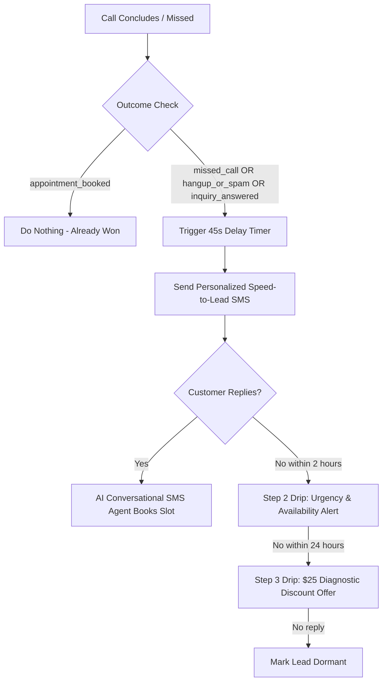
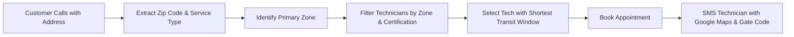

# 🚀 Advanced Automations & Enterprise Scaling Roadmap (M21 - M25)
## BlueCollar AI — US HVAC Autonomous Employee Platform

This document outlines the top **5 Advanced Enterprise Automations** to scale the HVAC AI Employee platform from the completed M1–M20 foundation into a high-tier, fully autonomous SaaS platform (competing with ServiceTitan, Housecall Pro, and EliseAI).

---

## 📑 Table of Contents
1. [Area 1: Autonomous Missed Call & Lead Recovery Engine (Speed-to-Lead)](#1-autonomous-missed-call--lead-recovery-engine)
2. [Area 2: Production Ultra-Low Latency Realtime Voice Engine](#2-production-ultra-low-latency-realtime-voice-engine)
3. [Area 3: Smart Technician Dispatch & Geographic Zone Routing](#3-smart-technician-dispatch--geographic-zone-routing)
4. [Area 4: Automated Review & Reputation Shielding Engine](#4-automated-review--reputation-shielding-engine)
5. [Area 5: Advanced Frontend Dashboards & Visual Control Hubs (M16–M20 UI)](#5-advanced-frontend-dashboards--visual-control-hubs)
6. [Phased Implementation Plan & Milestones](#phased-implementation-plan--milestones)

---

## 1. Autonomous Missed Call & Lead Recovery Engine

### 🎯 Objective & Business Impact
- **Problem**: 67% of US homeowners hire the first contractor who replies. If an HVAC shop misses a call or a caller hangs up without booking, that lead calls a competitor within 3 minutes ($1,200+ lost average job value).
- **Solution**: Sub-60-second autonomous SMS recovery with multi-touch AI drip sequence and conversational SMS appointment booking.

### ⚙️ Architecture & Technical Flow


### 🛠️ Key Components to Implement
1. **Recovery Worker / Queue**:
   - Event listener hooked into `CallLog` creation or `VoiceSession.endSession`.
   - Checks if caller has existing booked appointment; if not, registers a timed delayed job (BullMQ or Mongoose-backed timer).
2. **Dynamic Speed-to-Lead Templates**:
   - **Missed Call**: *"Hi {{firstName}}, sorry we missed your call at {{businessName}}! Are you experiencing an HVAC emergency or need a service appointment? Reply here or book a slot online: {{bookingLink}}"*
   - **Unbooked Inquiry**: *"Hi {{firstName}}, thank you for calling {{businessName}} regarding {{serviceName}}. We have 2 technician arrival windows open for tomorrow morning. Would you like us to hold one for you?"*
3. **Conversational Inbound SMS Booking Handler**:
   - When caller replies to recovery SMS, route to an SMS AI Agent utilizing `check_availability` and `book_appointment` tools via Twilio inbound SMS webhook (`/api/webhooks/twilio/sms`).

---

## 2. Production Ultra-Low Latency Realtime Voice Engine

### 🎯 Objective & Business Impact
- **Problem**: Traditional conversational voice engines with chained REST STT ➔ LLM ➔ TTS introduce 2–3 seconds of dead air, causing callers to think the line dropped or feel alienated by robotic delays.
- **Solution**: Sub-500ms bidirectional WebSocket streaming with human-like breathing, tone modulation, and real-time interruption (barge-in).

### ⚙️ Technical Stack Comparison
| Layer | Prototyping (Current) | Production Tier A (OpenAI Realtime) | Production Tier B (Modular Best-in-Class) |
|---|---|---|---|
| **Speech-to-Text (STT)** | Mock / AssemblyAI | OpenAI Realtime (Server VAD) | **Deepgram Nova-2** (~120ms latency) |
| **Reasoning / LLM** | Rule / Mock | GPT-4o Realtime Audio | **Claude 3.5 Sonnet** / **GPT-4o-mini** (~200ms) |
| **Text-to-Speech (TTS)** | Polly / Twilio Say | OpenAI Realtime Audio | **Cartesia Sonic** / **ElevenLabs Flash** (~100ms) |
| **End-to-End Latency** | N/A (Mock) | ~400ms - 600ms | **~300ms - 450ms** |

### 🛠️ Key Components to Implement
1. **Twilio Bidirectional Audio Bridge (`voice-stream.handler.ts`)**:
   - Handle inbound `media` events containing raw g.711 μ-law 8kHz audio packets.
   - Resample and stream directly to Deepgram WebSocket.
2. **Server-Side Voice Activity Detection (VAD) & Barge-In**:
   - Detect user speech onset during AI playback.
   - Instantly send `clear` message to Twilio WebSocket stream to abort audio buffer playback, ensuring the AI stops talking the instant the customer interrupts.
3. **OpenAI Realtime Provider Bridge (`voice-provider.service.ts`)**:
   - Native integration with `wss://api.openai.com/v1/realtime?model=gpt-4o-realtime-preview`.
   - Tool calling emitted via standard delta events.

---

## 3. Smart Technician Dispatch & Geographic Zone Routing

### 🎯 Objective & Business Impact
- **Problem**: Disorganized scheduling sends technicians crisscrossing the city, wasting 2–3 hours per tech per day in windshield drive-time and burning fuel.
- **Solution**: Zip-code zone clustering, technician skill-matching, and automated dispatch SMS with turn-by-turn navigation.

### ⚙️ Data Model & Workflow


### 🛠️ Key Components to Implement
1. **Service Zone Model (`service-zone.model.ts`)**:
   - Fields: `name`, `zipCodes: string[]`, `assignedTechnicianIds: ObjectId[]`, `travelBufferMinutes: number`.
2. **Technician Skills & Certification Matrix**:
   - Assign tags to technicians: `residential_ac`, `commercial_vrf`, `boiler_specialist`, `heat_pump_certified`.
   - When AI tool `check_availability` runs, it filters candidate calendar slots only from technicians certified for the caller's equipment (from M19 customer memory).
3. **Instant Tech Dispatch SMS**:
   - Upon booking, technician receives automated notification:  
     *"🚨 New Urgent AC Repair: 742 Evergreen Terr, Springfield. Unit: Carrier 19VS Inverter. Customer: Sarah Connor. Gate Code: #9921 (Dog in yard). Maps: https://maps.google.com/?q=..."*

---

## 4. Automated Review & Reputation Shielding Engine

### 🎯 Objective & Business Impact
- **Problem**: 88% of US consumers read Google reviews before calling an HVAC contractor. Unhappy customers leave public 1-star reviews, while satisfied customers forget to leave reviews.
- **Solution**: Automated CSAT post-service funnel that routes happy customers (4–5 stars) to Google Business Profile and shields negative feedback (1–3 stars) into a private internal ticket for rapid owner resolution.

### ⚙️ Smart Review Routing Funnel
```mermaid
flowchart TD
    JobDone[Appointment Status = Completed] --> Wait2h[Wait 2 Hours via Queue Worker]
    Wait2h --> SendCSAT[Send SMS: Rate Tech Service 1 to 5]
    SendCSAT --> UserReply{Customer Rating}
    UserReply -->|5 Stars (Excellent)| GoogleRedirect[Send Direct Google Review Link + $10 Gift Card Offer]
    UserReply -->|4 Stars (Good)| GoogleRedirect
    UserReply -->|1 - 3 Stars (Poor/Fair)| InternalShield[Block Google Link + Create Urgent Priority Alert for Owner]
    InternalShield --> OwnerCall[Owner Calls Customer to Resolve Issue Privately]
```

### 🛠️ Key Components to Implement
1. **Review Campaign Model (`review-campaign.model.ts`)**:
   - `appointmentId`, `customerId`, `technicianId`, `score`, `status` (`pending`, `positive_redirected`, `negative_shielded`, `escalated`).
2. **Automatic Webhook Trigger**:
   - When `AppointmentController.updateAppointmentStatus` sets status to `completed`, queue CSAT survey job.
3. **Escalation Notification**:
   - If customer replies with 1, 2, or 3, system marks lead as urgent escalation, alerts owner via email/SMS, and adds entry to Customer 360 timeline.

---

## 5. Advanced Frontend Dashboards & Visual Control Hubs

### 🎯 Objective & Business Impact
- **Problem**: The backend for M16–M20 (Customer 360, Knowledge Base, Policies, Memory, QA) is fully operational via API, but contractors need a clean visual dashboard to monitor intelligence and edit business rules.
- **Solution**: Responsive Next.js / Tailwind UI components integrated into the contractor portal.

### 🛠️ Key Dashboards to Build
1. **Customer 360 Interactive Drawer (`/app/customers`)**:
   - Clicking any customer opens a sliding panel displaying:
     - Lifetime Value badge ($) and customer tags (`VIP`, `Commercial`).
     - Unified activity timeline: chronological cards for Calls (with audio playback & transcript button), Leads, Appointments, and SMS logs.
     - Known Equipment & Property Preferences cards (Carrier heat pump, gate codes, pet warnings).
2. **AI Conversation QA & Quality Intelligence Hub (`/app/calls/qa`)**:
   - Overview KPI cards: **Average Resolution Score (e.g. 94%)**, **Policy Compliance Rate (100%)**, and **Flagged Calls Count**.
   - Flagged Calls table: Red highlighted rows for calls where customer was frustrated or hazardous gas smell was reported without transfer.
   - One-click modal to inspect AI summary and AI coaching tips.
3. **Business Knowledge Base & Guardrails Manager (`/app/settings/ai-knowledge`)**:
   - Visual FAQ and Policy Editor (add diagnostic fees, warranty guarantees, service area radius).
   - Guardrail Configuration: Slider for Minimum Advance Notice (e.g. 2 hours to 6 hours), Maximum Horizon (30 to 90 days), and Emergency Keyword list tag-input.

---

## 📈 Phased Implementation Plan & Milestones

| Phase | Module / Feature | Estimated Scope | Priority |
|:---:|---|---|:---:|
| **Phase 1** | **Frontend Visual Hubs for M16–M20**<br>(Customer 360 Drawer, QA Dashboard, Knowledge Base Settings) | 2–3 Days | 🔥 High (Immediate UI payoff) |
| **Phase 2** | **Missed Call Speed-to-Lead & Drip Engine**<br>(Sub-60s SMS trigger, Drip Queue, Conversational SMS Booking) | 2–3 Days | 🔥 High (Direct Revenue Recovery) |
| **Phase 3** | **Reputation & Review Shielding Engine**<br>(CSAT 1-5 SMS, Google Business Link, Negative Feedback Shield) | 1–2 Days | ⚡ Medium (High Business Value) |
| **Phase 4** | **Smart Technician Dispatch & Zones**<br>(Zip Code Service Zones, Route Distance Buffer, Tech SMS Dispatch) | 2 Days | ⚡ Medium (Operational Efficiency) |
| **Phase 5** | **Production Realtime Voice Streaming Bridge**<br>(Twilio WebSocket bidirectional audio, Deepgram / OpenAI Realtime) | 3–4 Days | 💎 Advanced (Flagship Telephony) |

---

*Document Created: September 18, 2026*  
*Repository: `d:\z_US_market`*  
*Platform: BlueCollar AI — US HVAC Contractor Autonomous OS*
